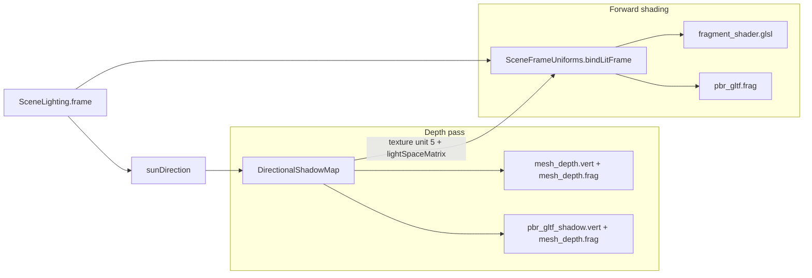
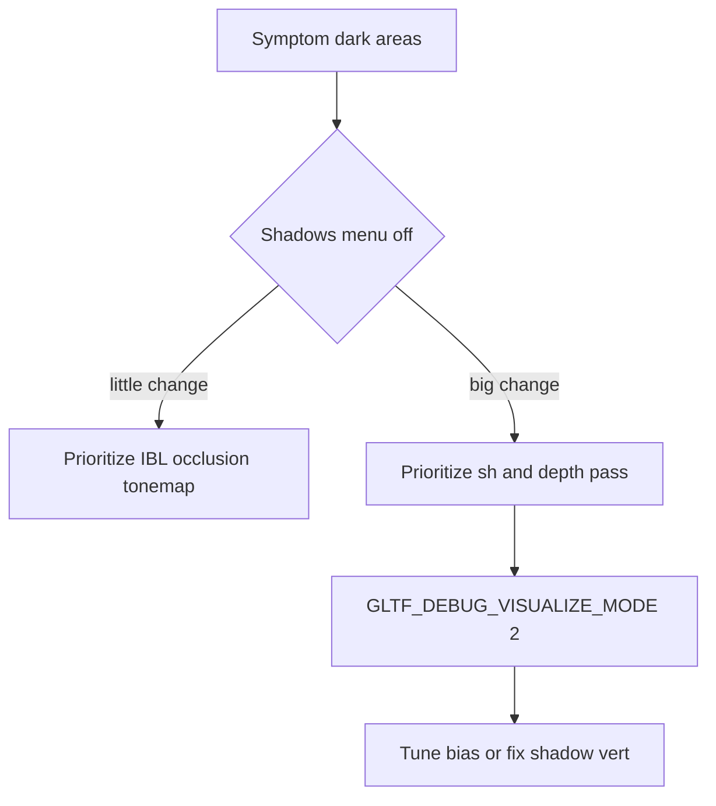

# Рендеринг: ландшафт (Assimp/OBJ) и glTF 2.0 (нативный runtime)

## 1. Два пути загрузки

| Режим | Конфиг | Загрузчик | Шейдер |
|--------|--------|-----------|--------|
| **glTF 2.0 нативный** | `GameConfig.USE_GLTF_NATIVE_LOADER = true` (по умолчанию) | jgltf (`GltfModelReader`), пакет `ru.reweu.game.gltf` | `pbr_gltf.vert` / `pbr_gltf.frag` |
| **Legacy (Assimp)** | `USE_GLTF_NATIVE_LOADER = false` | `ModelLoader` (Assimp) | `vertex_shader.glsl` / `fragment_shader.glsl` |

Переключатель: [`GameConfig.java`](../src/main/java/ru/reweu/game/GameConfig.java).

### 1.1 Редактор (DCC) и этот движок

Скрин из типичного редактора на белом фоне (студийный HDRI, мягкая контактная тень) **не обязан** совпадать с наружной сценой в движке: здесь направленное солнце, одна ортогональная карта теней ([`DirectionalShadowMap`](../src/main/java/ru/reweu/game/render/DirectionalShadowMap.java)), IBL из HDR equirect или процедурной карты ([`EnvironmentIbl`](../src/main/java/ru/reweu/game/render/ibl/EnvironmentIbl.java)), тонмап ACES. Без **того же** HDRI и набора источников полное визуальное совпадение недостижимо.

- **Наружная сцена (B, по умолчанию):** [`GameConfig.STUDIO_LIGHTING_PRESET`](../src/main/java/ru/reweu/game/GameConfig.java) = `false` — усилены солнце/IBL/exposure относительно прежних констант; в кадр идут [`SceneLighting.effectiveExposure()`](../src/main/java/ru/reweu/game/render/SceneLighting.java), `effectiveIblIntensity()`, `effectiveFillStrength*()` (базовые значения — `EXPOSURE`, `IBL_INTENSITY`, `FILL_STRENGTH_*`).
- **Пресет «студия» (A):** `STUDIO_LIGHTING_PRESET = true` — мягче ключ (`sunIntensity` через пониженный `SUN_INTENSITY_MAX`), сильнее fill и IBL, светлее небо/`clearColor`; эмулирует **часть** каталожного вида, но не заменяет отдельный студийный HDR и белый пол.

Тени на траве: центр орто-фрустума смещён к машинам ([`GameConfig.shadowOrthoCenterX` / `Z`](../src/main/java/ru/reweu/game/GameConfig.java)); ландшафт — [`shadow_pcf3x3.glsl`](../src/main/resources/shaders/include/shadow_pcf3x3.glsl), glTF — отдельный bias в [`shadow_pcf3x3_gltf.glsl`](../src/main/resources/shaders/include/shadow_pcf3x3_gltf.glsl) (§8). Прозрачное стекло фар как в glTF **KHR_materials_transmission** в проекте **не** реализовано — см. §7.

### 1.2 Общие куски шейдеров (`shaders/include/`)

| Файл | Назначение |
|------|------------|
| [`tonemap_exposure.glsl`](../src/main/resources/shaders/include/tonemap_exposure.glsl) | ACES + `tonemapDisplay` |
| [`math_const.glsl`](../src/main/resources/shaders/include/math_const.glsl) | `PI` |
| [`pbr_ggx.glsl`](../src/main/resources/shaders/include/pbr_ggx.glsl) | GGX + Schlick (подключает `math_const`) |
| [`shadow_pcf3x3.glsl`](../src/main/resources/shaders/include/shadow_pcf3x3.glsl) | PCF 5×5 для карты теней (**ландшафт** / `fragment_shader.glsl`); `u_shadowBiasScale` |
| [`shadow_pcf3x3_gltf.glsl`](../src/main/resources/shaders/include/shadow_pcf3x3_gltf.glsl) | PCF 5×5, больший bias для **glTF** (`pbr_gltf.frag`); см. §8–9 |
| [`spherical_equirect_uv.glsl`](../src/main/resources/shaders/include/spherical_equirect_uv.glsl) | equirect UV из направления |

[`ShaderProgram.preprocessIncludes`](../src/main/java/ru/reweu/game/render/ShaderProgram.java) подставляет `#include` и **дедуплицирует** повтор одного пути. Не включайте `math_const` отдельной строкой **перед** `pbr_ggx` в том же корневом шейдере — иначе вложенный `#include math_const` из `pbr_ggx` будет пропущен.

## 2. Нативный glTF 2.0 (jgltf + OpenGL)

### 2.1 Загрузка и сцена

- **Библиотека:** `de.javagl:jgltf-model`, `de.javagl:jgltf-impl-v2` (Maven).
- **Точка входа:** [`GltfScene.load(Path)`](../src/main/java/ru/reweu/game/gltf/GltfScene.java) — читает `.glb`/`.gltf` с диска (ресурс через `ResourceLoader.loadResourceAsFile` → `Path`).
- **Граф:** обход узлов сцены (`SceneModel` → `NodeModel`), для каждого примитива — [`GltfPrimitiveBuilder.build`](../src/main/java/ru/reweu/game/gltf/GltfPrimitiveBuilder.java) (interleaved VBO + EBO).
- **Sparse accessors:** разворачиваются в плотные данные на стороне jgltf при `AccessorDatas.create` / `AccessorModel.getAccessorData()` (см. jgltf).

### 2.2 Атрибуты вершин (layout 0–11)

| Location | Данные |
|----------|--------|
| 0–2 | POSITION, NORMAL, TANGENT (xyzw, w — handedness) |
| 3–4 | TEXCOORD_0, TEXCOORD_1 |
| 5 | COLOR_0 |
| 6–7 | JOINTS_0, WEIGHTS_0 (скиннинг) |
| 8–11 | дельты POSITION для первых четырёх morph targets |

Тангенты: при отсутствии в файле — [`TangentSpace`](../src/main/java/ru/reweu/game/gltf/TangentSpace.java). Нормали: при отсутствии/нулевых — [`GltfNormals`](../src/main/java/ru/reweu/game/gltf/GltfNormals.java).

### 2.3 Материалы и текстуры

- Модель: [`MaterialModelV2`](../src/main/java/ru/reweu/game/gltf/GltfPbrRenderer.java) (jgltf) — baseColor (+ factor), metallicRoughness (+ factors), normal, occlusion, emissive, `alphaMode` / `alphaCutoff`, `doubleSided`.
- Текстуры: [`GltfTextureRegistry`](../src/main/java/ru/reweu/game/gltf/GltfTextureRegistry.java) — lazy, отдельные слоты sRGB (baseColor/emissive) и linear (MR, normal, occlusion) через [`Texture.tryFromMemory`](../src/main/java/ru/reweu/game/loader/Texture.java).

#### Увязка с [glTF 2.0 Specification](https://registry.khronos.org/glTF/specs/2.0/glTF-2.0.html)

| Тема | В движке |
|------|----------|
| **Цвет** | Base color / emissive: загрузка в `GL_SRGB8_ALPHA8` (§3.9.2, §3.9.3 emissive); MR/normal/occlusion — линейные (§3.9.2). Итоговый кадр: линейный HDR → exposure → ACES → `GL_FRAMEBUFFER_SRGB` в [`Game3d`](../src/main/java/ru/reweu/game/Game3d.java). |
| **Occlusion** | По спецификации влияет на **косвенный** свет, прямой не затемняется (§3.9.3). В [`pbr_gltf.frag`](../src/main/resources/shaders/pbr_gltf.frag) множитель `occlusion` применяется к диффузному и зеркальному **IBL**; направленное солнце (`Lo`), fill и emissive без occlusion. |
| **`doubleSided`** | §3.9.5: для задних граней нормаль инвертируется — `u_doubleSided` + `gl_FrontFacing` во фрагментном шейдере после TBN. |
| **PBR** | Металл-диэлектрик mix, GGX+Schlick в духе приложения B (информативное); точная физика и расширения — см. §7. |

### 2.4 Шейдинг

- **Наружный свет (статичный день):** единая модель в [`SceneLighting`](../src/main/java/ru/reweu/game/render/SceneLighting.java): азимут и высота солнца над горизонтом (`SUN_AZIMUTH_DEG`, `SUN_ELEVATION_DEG`), из них вычисляются `sunDirection`, `sunColor`, `sunIntensity`, цвета гемисферы (`skyAmbientColor`, `groundAmbientColor`), направление/цвет fill и цвет заливки кадра `clearColor`. В GPU это попадает через [`SceneFrameUniforms.bindLitFrame`](../src/main/java/ru/reweu/game/render/SceneFrameUniforms.java) (вызывается из [`WorldRenderer.prepareFrameFor`](../src/main/java/ru/reweu/game/render/WorldRenderer.java)): один набор на кадр для `fragment_shader` и `pbr_gltf` — солнце, fill, ambient, exposure, тени, IBL, позиция камеры из `view`. После смены углов перезапустите приложение (IBL bake один раз при старте).
- Фрагментный шейдер: GGX + Fresnel-Schlick + Smith для направленного света и fill; **image-based lighting** для диффузного и зеркального окружения, см. [`pbr_gltf.frag`](../src/main/resources/shaders/pbr_gltf.frag).
- **IBL (glTF PBR):** при старте [`EnvironmentIbl`](../src/main/java/ru/reweu/game/render/ibl/EnvironmentIbl.java) строит из HDR equirect (или процедурной карты) env cubemap → **irradiance** (диффуз) и **prefiltered specular** (mips); в шейдере: диффуз и спекуляр умножаются на один и тот же `u_iblIntensity` (`SceneLighting.effectiveIblIntensity()`), иначе диффузный IBL недосвечивает кузов в тени. Формулы: `irradiance * albedo * kD * occlusion * u_iblIntensity` и `prefilter * BRDF * u_iblIntensity` с [`BrdfLutTexture`](../src/main/java/ru/reweu/game/render/BrdfLutTexture.java).
- **HDR-ассет (опционально):** путь [`GameConfig.IBL_HDR_EQUIRECT`](../src/main/java/ru/reweu/game/GameConfig.java) (`/ibl/environment.hdr` в classpath). Если файла нет — [`IblEquirectLoader`](../src/main/java/ru/reweu/game/render/ibl/IblEquirectLoader.java) генерирует линейную equirect-текстуру (небо/земля + диск солнца по `SceneLighting`). Если HDR **загружен с диска**, окружение в IBL **не** совпадает с углами солнца из `SceneLighting` — для полного совпадения используйте процедурный fallback или свой HDR под сцену.
- **Текстурные юниты (кадр, `SceneFrameUniforms` / `WorldRenderer.prepareFrameFor`):** тень = 5, BRDF LUT = 6, **irradiance = 7**, **prefilter = 8**. Слоты материала glTF (baseColor … emissive): **0–4**, константы — [`GltfShaderTextureUnits`](../src/main/java/ru/reweu/game/gltf/GltfShaderTextureUnits.java).
- Ландшафт и legacy Assimp по-прежнему без полного cubemap-IBL (см. §3).

### 2.5 Скиннинг

- Joint matrices: [`GltfSkinMatrices`](../src/main/java/ru/reweu/game/gltf/GltfSkinMatrices.java) — `inverse(meshGlobal) * jointGlobal * inverseBindMatrix`, до 64 суставов.
- UBO `JointBlock` (binding 0), инициализация биндинга: `GltfPbrRenderer.initJointBlock`.

### 2.6 Morph targets

- В GPU учитываются **первые 4** цели (атрибуты 8–11); веса из `MeshModel.getWeights()` / `NodeModel.getWeights()` или переопределение при анимации.

### 2.7 Анимации

- [`GltfAnimations.createModelAnimations`](https://github.com/javagl/JglTF) + `AnimationManager` (LOOP), шаг: `GltfScene.updateAnimation(deltaTime)` из [`Game3d`](../src/main/java/ru/reweu/game/Game3d.java) / [`SceneRenderer`](../src/main/java/ru/reweu/game/render/SceneRenderer.java).

### 2.8 Интеграция в кадр

- [`SceneRenderer`](../src/main/java/ru/reweu/game/render/SceneRenderer.java): после ландшафта — непрозрачный проход glTF (`render(..., opaquePassOnly=true)`), затем Assimp-пропы, затем blend-проход glTF (`opaquePassOnly=false`).
- Корневая матрица пропа: `translate(propWorld) * scale(FORD_MUSTANG_MODEL_SCALE)`.
- Перед каждым батчем glTF: `WorldRenderer.prepareFrameFor(gltfShader, view, projection)` — те же per-frame униформы, что и для ландшафта; [`GltfPbrRenderer.draw`](../src/main/java/ru/reweu/game/gltf/GltfPbrRenderer.java) задаёт только матрицы модели/вида/проекции, скин, морф и материал (без повторной установки солнца/камеры).

## 3. Legacy: Assimp + `fragment_shader.glsl`

Упрощённый PBR без полного glTF-материала; детали и дампы — прежние разделы ниже (Assimp-отчёты, `Mesh`, слоты текстур).

### 3.1 Атрибуты и uniform: `vertex_shader.glsl`

| Атрибут | layout | Источник |
|--------|--------|----------|
| позиция | 0 | VBO |
| нормаль | 1 | VBO |
| UV | 2 | VBO |
| вершинный цвет (glTF `COLOR_0`) | 3 | VBO |

| Uniform | Где задаётся |
|--------|----------------|
| `model` | `ShaderRender.renderWorldMeshes` |
| `view` / `projection` | `WorldRenderer.prepareFrame` |
| `usePlanarUv` / `uvBounds` | `Mesh.render` |

### 3.2 Таблица uniform: `fragment_shader.glsl`

| Uniform | Назначение |
|--------|------------|
| `texture1`, `useDiffuseTexture`, `diffuseColor`, `materialAlpha` | base color |
| `textureMetallicRoughness`, `useSpecularTexture` | MR (упрощённо) |
| `sunDirection`, `sunColor`, `sunIntensity`, `ambientColor`, `cameraPosition` | свет |
| `opaqueGeometryPass` | принудительная непрозрачность кузова |

Биндинги `useNormalTexture` / `textureNormal` и т.д. в старом фрагментном шейдере не используются.

## 4. Аудит Assimp (legacy)

```bash
mvn -q compile exec:java -Dexec.mainClass=ru.reweu.game.tools.AssimpDumpTool
mvn -q compile exec:java -Dexec.mainClass=ru.reweu.game.tools.AssimpDumpTool -Dexec.args="/models/your.glb"
```

Переменная `GAME_DUMP_ASSIMP_REPORT=1` или `GameConfig.DEBUG_DUMP_ASSIMP_REPORT`.

## 5. Визуальный контроль

1. **sRGB:** `GL_FRAMEBUFFER_SRGB` в `Game3d`.
2. **glTF PBR:** сравнение с DCC по Mustang при `USE_GLTF_NATIVE_LOADER = true`.
3. **Прозрачность:** blend только для материалов с `alphaMode` BLEND; MASK — `discard` по `alphaCutoff` в `pbr_gltf.frag`.
4. **Стекло (Assimp):** эвристика имён в `Mesh`; при glTF — по материалу alpha.
5. **Exposure и тонмап:** `SceneLighting.effectiveExposure()` (база — `EXPOSURE`) передаётся uniform `exposure` из [`WorldRenderer.prepareFrameFor`](../src/main/java/ru/reweu/game/render/WorldRenderer.java) и в [`SkyRenderer`](../src/main/java/ru/reweu/game/render/SkyRenderer.java). Один и тот же **ACES** и порядок «линейный HDR → × exposure → тонмап» заданы в [`include/tonemap_exposure.glsl`](../src/main/resources/shaders/include/tonemap_exposure.glsl) и подключаются в `fragment_shader.glsl`, `pbr_gltf.frag`, `fragment_transparent_shader.glsl` через `#include` (препроцессор в [`ShaderProgram`](../src/main/java/ru/reweu/game/render/ShaderProgram.java)). Шейдеры IBL bake (`shaders/ibl/*.frag`) **не** используют display-тонмап — они пишут линейный HDR в кубемапы.

## 6. Ссылки на исходники

- glTF: `ru.reweu.game.gltf.*`, `pbr_gltf.vert`, `pbr_gltf.frag`.
- Legacy: `ru.reweu.game.loader.ModelLoader`, `Mesh`, `fragment_shader.glsl`.
- Кадр: `WorldRenderer`, `SceneRenderer`, `ShaderRender`, `Game3d`.

## 7. Ограничения и расширения

- Расширения **KHR_*** (например `KHR_texture_transform`, `KHR_materials_unlit`) не реализованы — при необходимости отдельные задачи и тестовые модели из [glTF Sample Models](https://github.com/KhronosGroup/glTF-Sample-Models).
- **Стекло / фары:** `KHR_materials_transmission` (и связанные volume/IOR для «настоящего» стекла) **не** реализованы; emissive и отражения из IBL дают читаемые лампы при [`SceneLighting.emissiveDisplayBoost()`](../src/main/java/ru/reweu/game/render/SceneLighting.java) в [`GltfPbrRenderer`](../src/main/java/ru/reweu/game/gltf/GltfPbrRenderer.java). В [`pbr_gltf.frag`](../src/main/resources/shaders/pbr_gltf.frag) для spec IBL используется смягчённый множитель occlusion (иначе AO-текстура даёт чёрные «дыры» на фарах/щелях), а для сочетания metallic≈1 и почти чёрного baseColor — нижняя граница F0 как у диэлектрика (частая ошибка разметки стекла без transmission). Для сходства с DCC по глубине стекла — отдельная задача: transmission pass или упрощённый alpha-blend шейдер для стеклянных материалов.
- Для нативного glTF реализован стандартный split-sum IBL (irradiance + prefilter + BRDF LUT); без KTX2/env-специфичных расширений glTF.

## 8. Направленные тени (один каскад): цепочка и проверка

### 8.1 Схема (растровый путь)



Исходники: [`DirectionalShadowMap`](../src/main/java/ru/reweu/game/render/DirectionalShadowMap.java), [`SceneRenderer.renderTransparent`](../src/main/java/ru/reweu/game/render/SceneRenderer.java), [`SceneFrameUniforms`](../src/main/java/ru/reweu/game/render/SceneFrameUniforms.java), [`WorldRenderer`](../src/main/java/ru/reweu/game/render/WorldRenderer.java).

**Java-цепочка на кадр**

1. `LightingFrame lit = SceneLighting.frame(...)` — в том числе `sunDirection`.
2. `shadowMap.updateLightMatrices(lit.sunDirection(), shadowCx, shadowCz)` — та же ось света, что и в освещении.
3. Если `RuntimeGraphicsSettings.isShadowsEnabled()`: `bindForWriting` → отрисовка глубины ландшафта / пропов / glTF (`mesh_depthShader`, `gltfDepthShader`) → `endWrite`.
4. `worldRenderer.prepareFrame(lit, view, projection, worldShadowSample)` — в uniform попадают `shadowMap`, `lightSpaceMatrix`, `shadowsEnabled` (флаг **выборки** PCF, не генерации карты).

### 8.2 Ресурсы GLSL и сборка

Шейдеры читаются с диска из classpath ([`ShaderProgram`](../src/main/java/ru/reweu/game/render/ShaderProgram.java) → `ResourceLoader.loadResourceAsFile`). После правок в `src/main/resources/shaders/` нужен **`mvn compile`** (или копирование в `target/classes`), иначе в рантайме остаётся старая версия.

Проверка совпадения деревьев (ожидается пустой вывод `diff` после сборки):

```bash
mvn -q compile
diff -qr src/main/resources/shaders target/classes/shaders
```

### 8.3 Два варианта PCF (bias)

| Включение | Файл | Назначение |
|-----------|------|------------|
| `#include` в [`fragment_shader.glsl`](../src/main/resources/shaders/fragment_shader.glsl) | [`shadow_pcf3x3.glsl`](../src/main/resources/shaders/include/shadow_pcf3x3.glsl) | Ландшафт / legacy Assimp |
| `#include` в [`pbr_gltf.frag`](../src/main/resources/shaders/pbr_gltf.frag) | [`shadow_pcf3x3_gltf.glsl`](../src/main/resources/shaders/include/shadow_pcf3x3_gltf.glsl) | glTF PBR — **больший** slope/min bias против самозатенения кузова |

Оба варианта: **PCF 5×5** (25 сэмплов), uniform `u_shadowBiasScale` ← [`GameConfig.effectiveShadowBiasScaleForProgram`](../src/main/java/ru/reweu/game/GameConfig.java): без env — ландшафт **1.0**, glTF **1.38**; `GAME_SHADOW_BIAS_SCALE` задаёт одно значение для обоих. На glTF дополнительно `u_shadowReceiveFloor` ← [`effectiveGltfShadowReceiveFloor()`](../src/main/java/ru/reweu/game/GameConfig.java) (`GAME_SHADOW_RECEIVE_FLOOR`, по умолчанию 0.1 — минимум `sh` для прямого солнца). Depth-pass: `glPolygonOffset` в [`DirectionalShadowMap.bindForWriting`](../src/main/java/ru/reweu/game/render/DirectionalShadowMap.java).

Одинаковое имя функции `shadowPcf3x3` в разных TU — ок, каждый фрагментный шейдер компилируется отдельно.

### 8.4 Отладка фактора тени glTF (`sh`)

Без пересборки: `GLTF_DEBUG_VISUALIZE_MODE=2` (в логе при старте: `gltf debug visualize mode=2`). Картинка: оттенки серого = `sh` (1 = освещено солнцем по карте теней). Режимы 0/1/2 см. [`GameConfig.effectiveGltfDebugVisualizeMode()`](../src/main/java/ru/reweu/game/GameConfig.java).

Сравнение с тенями **выкл**: меню ESC «Тени» или константа/поведение `GLTF_DEBUG_DISABLE_SHADOWS` (только выборка в glTF PBR, см. §8.6) — если картинка почти не меняется, доминирует не карта теней (см. §9.1).

### 8.5 Меню ESC и тени

[`RuntimeGraphicsSettings`](../src/main/java/ru/reweu/game/RuntimeGraphicsSettings.java): «Тени» выключает **depth-pass** и ставит `shadowsEnabled=0` в шейдерах; текстура карты может оставаться старой до следующего включения — это ожидаемо для выборки «выкл». В том же меню ESC: слева чекбоксы и «Выход»; справа **сайдбар** с горизонтальными **слайдерами** (освещение × и тени). Перетаскивание по треку; старт из env/дефолтов [`GameConfig`](../src/main/java/ru/reweu/game/GameConfig.java) для теней, освещение × с **1.0**, затем при наличии файла — поверх читается сохранение ([`RuntimeGraphicsSettingsPersistence`](../src/main/java/ru/reweu/game/RuntimeGraphicsSettingsPersistence.java): `graphics-settings.json` в каталоге конфигурации, см. javadoc класса). Сохранение при отпускании ЛКМ после изменения, при закрытии меню ESC и при выходе из игры.

### 8.6 Ray tracing

При `GameConfig.RAY_TRACE_ENABLED` кадр идёт через [`RayTraceRenderer`](../src/main/java/ru/reweu/game/render/rt/RayTraceRenderer.java) и [`ray_trace.comp`](../src/main/resources/shaders/rt/ray_trace.comp): тень солнца — луч `anyHit` к источнику, **не** та же depth-текстура, что у растрового пути. Проверка карт теней из §8.1 относится к **растру**.

**Отладка:** `GLTF_DEBUG_DISABLE_SHADOWS` отключает только **выборку** в PBR ([`SceneRenderer`](../src/main/java/ru/reweu/game/render/SceneRenderer.java) `gltfShadowSample`); depth-pass при включённых тенях может всё ещё писать карту.

### 8.7 Один путь morph + skin → world (depth vs forward)

Чтобы исключить расхождение геометрии между depth-pass и forward для glTF, morph и скинning собраны в общий include [`pbr_gltf_world4.glsl`](../src/main/resources/shaders/include/pbr_gltf_world4.glsl): его вызывают [`pbr_gltf.vert`](../src/main/resources/shaders/pbr_gltf.vert) и [`pbr_gltf_shadow.vert`](../src/main/resources/shaders/pbr_gltf_shadow.vert). Любая правка порядка morph/скина должна делаться **там**.

## 9. «Жёсткие» тени и контраст: что крутить

Аналог советов из других движков (Three.js и т.д.) — здесь соответствие параметрам.

| Симптом / цель | Где в game-shader |
|----------------|-------------------|
| Слишком тёмные участки в тени, общий контраст | `GAME_EXPOSURE_SCALE`, `GAME_IBL_INTENSITY_SCALE` ([`GameConfig`](../src/main/java/ru/reweu/game/GameConfig.java)); константы [`SceneLighting.Outdoor`](../src/main/java/ru/reweu/game/render/SceneLighting.java) (`SUN_INTENSITY_MAX`, `FILL_STRENGTH_*`, `IBL_INTENSITY`); меню ESC. |
| Самозатенение (acne), «грязь» на кузове | Без env на glTF уже выше bias (см. §8.3); при необходимости `GAME_SHADOW_BIAS_SCALE` (мир+glTF) или только подкрутить glTF через тот же ключ. [`GAME_SHADOW_MAP_SIZE`](../src/main/java/ru/reweu/game/GameConfig.java) (4096). |
| Кузов слишком тёмный при включённых тенях | `GAME_SHADOW_RECEIVE_FLOOR` (0…1, по умолчанию 0.1) — пол для `sh` у прямого солнца; `0` отключает полностью. |
| Мягче край тени (без CSM) | Уже **PCF 5×5**; сильнее размытие — только увеличение ядра/радиуса в GLSL (дороже). |
| Геометрический bias | `glPolygonOffset` при записи карты ([`DirectionalShadowMap`](../src/main/java/ru/reweu/game/render/DirectionalShadowMap.java)). |
| Разрешение карты | `GAME_SHADOW_MAP_SIZE` или `GameConfig.DEFAULT_SHADOW_MAP_SIZE` + пересборка; размер в логе `[Config]`. |

Переменные `GAME_*` читаются при старте JVM; после изменения констант в `SceneLighting` нужна **пересборка** (`mvn compile`).

### 9.1 Если тюнинг bias/PCF почти не меняет картину

Сначала **зафиксируйте симптом** (фаза 0): где тёмные пятна (трава / кузов / стекло), при каком ракурсе; что даёт меню «Тени» off — если изменение слабое, вероятнее всего визуал тянет не карта теней, а IBL, occlusion, тонмап или exposure (**H1**).

**Изоляция канала тени (фаза 1):** `GLTF_DEBUG_VISUALIZE_MODE=2` — на экране только `sh`. Солнечный вклад: в меню отключить солнце, оставить fill/IBL и смотреть, остаётся ли «тьма».

**Исключить occlusion под видом тени (фаза 2):** `GAME_DEBUG_GLTF_NO_IBL_OCCLUSION=1` — в [`pbr_gltf.frag`](../src/main/resources/shaders/pbr_gltf.frag) для IBL принудительно `occlusion=1` (прямое солнце не трогается). Дополнительно можно опустить окружение: `GAME_IBL_INTENSITY_SCALE=0` и оценивать только `Lo` от солнца/fill.

**Геометрия depth vs color (фаза 3):** §8.7; на модели без morph и скина проверить, исчезает ли артефакт.

**Точечные рычаги после гипотезы (фаза 4):** если виноват PCF vs normal map (**H4**), A/B: `GAME_SHADOW_PCF_USE_SHADING_NORMAL=1` (slope-bias от шейдинговой `N` вместо `Ng`). Если подтверждена карта — §9 таблица (`GAME_SHADOW_BIAS_SCALE`, дефолтный bias glTF, `GAME_SHADOW_RECEIVE_FLOOR`, орто/frustum в [`DirectionalShadowMap`](../src/main/java/ru/reweu/game/render/DirectionalShadowMap.java)). Режим `GLTF_DEBUG_VISUALIZE_MODE=2` показывает `sh` **до** `receiveFloor`. Если не карта — крутить exposure, IBL, occlusion strength в шейдере/освещении, а не bias.

**Прочее:** несколько вызовов `prepareFrameFor` с разным `shadowSamplingEnabled` (**H5**) — при сомнении один раз залогировать `shadowsEnabled` на кадр для glTF. Устаревшие шейдеры в classpath (**H6**) — `mvn compile` и `diff -qr` из §8.2.


